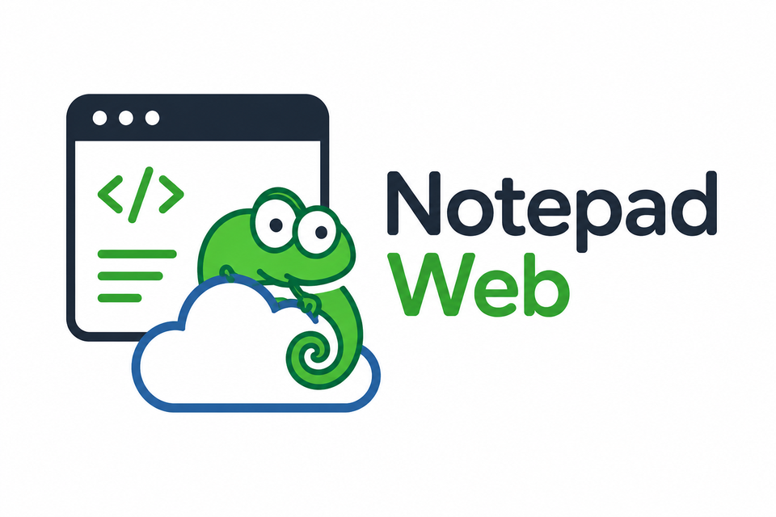
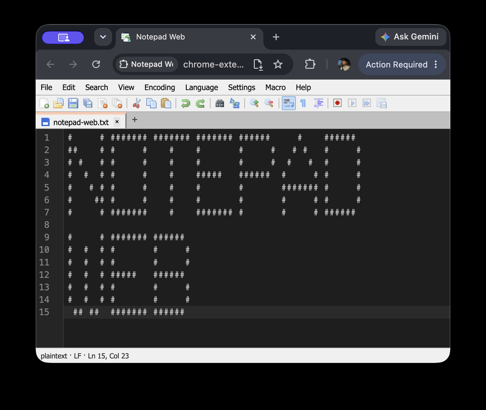

<p align="center">
  
</p>

# Notepad Web

A faithful, fully-offline web / Chrome-extension port of Notepad++ (via NotepadNext),
powered by **CodeMirror 6** and **Wasmoon** (Lua 5.4 in WASM).


[](https://chromewebstore.google.com/detail/notepad-web/jfhgpoliojbbmiknmdbefeamimlekgdn)
[](https://chromewebstore.google.com/detail/notepad-web/jfhgpoliojbbmiknmdbefeamimlekgdn)


<p align="center">
  <a href="https://chromewebstore.google.com/detail/notepad-web/jfhgpoliojbbmiknmdbefeamimlekgdn"><b>⬇&nbsp; Install from the Chrome Web Store</b></a>
</p>

> **Notepad Web is an independent project and is not affiliated with, endorsed by,
> or sponsored by Notepad++ or NotepadNext.**

<p align="center">
  
</p>

## Why this exists

Notepad Web started as a labor of love: an attempt to bring the Notepad++
experience that so many of us grew up with into the browser, for the times the
desktop app isn't within reach. Notepad++ is deep and battle-tested, and — being
honest — not every feature crosses over to a browser sandbox smoothly. Some had
to be reworked, and some are still on the way (see
[Known limitations](#known-limitations) for the honest gaps).

It's also built and tested by one person, so coverage only stretches as far as
one pair of hands and one machine allow. If something feels off while you're
using it, **please [open an issue](../../issues/new/choose)** — I genuinely
appreciate it. Every report is read and triaged in good faith, and the ones that
point to real problems are prioritised. Bit by bit, that feedback is what makes
Notepad Web more stable and a nicer place to write.

Thank you for giving it a try. 💚

## What it is

Notepad Web is a GPL-3.0 web port of **NotepadNext** (which itself reimplements
**Notepad++**). It bundles NotepadNext's real `.lua` language definitions and toolbar
icons, then executes them inside Chrome via Wasmoon (Lua 5.4 compiled to WASM),
reproducing the authentic Notepad++ light theme and language-detection logic without
any remote requests.

The extension works 100% offline. It requires no server, makes no network calls, and
requests only the `storage` permission.

## Features

**Editor core**

- **CodeMirror 6** editor core: fast, accessible, MV3-compatible.
- **Wasmoon Lua-in-WASM**: executes the real NotepadNext `init.lua` + per-language
  `.lua` palette files for faithful Notepad++ syntax colours.
- **Language detection** from file extension via the real `.lua` language registry —
  same logic as the desktop app.
- Faithful **Notepad++ light theme** (token colours, status bar, chrome).
- **tabSize** and **wordWrap** settings with per-tab state and cross-tab inheritance
  for new tabs.
- Open/save real files (File System Access API) with upload/download fallback.
- Session restore for unsaved buffers and cursor/scroll position (IndexedDB).
- **Menu bar** (File / Edit / View / Search / Language / Tools) with keyboard
  accelerators.
- **Dockview** multi-pane dock panel layout.

**Editor decorators**

- **Bookmarks**: gutter markers, toggle (Ctrl+F2), next/prev (F2/Shift+F2), clear all,
  invert, cut/copy/delete bookmarked lines.
- **Mark All Occurrences**: 3 distinct highlight styles + Clear per-style / Clear All.
- **Clickable URL links**: Ctrl/Cmd+click to open in a new tab.
- **HTML tag auto-close**: typing `>` closes the open tag.
- Bracket matching, selection-match highlighting, word autocompletion,
  auto-close/surround brackets.

**Macros + Lua Console**

- **Macro record/replay**: Start/Stop Recording, Playback (Ctrl+Shift+P), run N times
  or to end-of-file, save/run named macros.
- **Lua Console dock**: persistent Wasmoon REPL with an `editor` API bridge over the
  active document.

**Search system**

- **3-tab Find / Replace / Mark dialog** (Ctrl+F / Ctrl+H): match-case, whole-word,
  wrap-around, backwards, Normal/Extended/Regex modes; MRU history.
- **Find in all open documents** → clickable Search Results dock.
- **Mark All** + Copy Marked Text; **Search-and-Bookmark** (bookmark all matching
  lines).

**Extension compliance**

- 100% offline, zero telemetry, zero remote requests.
- MV3 CSP: `script-src 'self' 'wasm-unsafe-eval'; object-src 'self'`.
- Permissions: `["storage"]` only.

## Install

### From the Chrome Web Store (recommended)

**[➜ Install Notepad Web](https://chromewebstore.google.com/detail/notepad-web/jfhgpoliojbbmiknmdbefeamimlekgdn)** — one click, auto-updates.

### From source (for development)

```bash
git clone https://github.com/codecancu/notepad-web.git
cd notepad-web
npm ci
npm run build      # produces dist/
```

Then in Chrome:

1. Open `chrome://extensions`.
2. Enable **Developer mode** (top-right toggle).
3. Click **Load unpacked** and select the `dist/` folder.

## Development

```bash
npm run dev        # webpack watch build
npm test           # unit tests (Vitest)
npm run test:e2e   # Playwright end-to-end tests
npm run lint       # ESLint + Prettier check
npm run typecheck  # tsc --noEmit
npm run package    # manifest-compliance + no-remote-code checks, then zips dist/
```

The `npm run package` step verifies that no CDN/remote URLs survived the build and that
the manifest declares only allowed permissions before producing
`notepad-web-v0.3.0.zip`.

## Architecture

- **CodeMirror 6** (`@codemirror/*`, `@lezer/*`) provides the editor core, language
  parsers, and decoration system.
- **Wasmoon** runs the real NotepadNext `init.lua` and per-language `.lua` files inside
  the extension (Lua 5.4 compiled to WASM), reproducing authentic syntax highlighting
  and theme colours with no native code or remote requests.
- **dockview-core** manages the multi-panel dock layout (Document Map, Function List,
  Lua Console, Search Results).
- **MV3 compliance**: permissions are `["storage"]` only; CSP is
  `script-src 'self' 'wasm-unsafe-eval'`; a build-time scan (`scripts/package.mjs`)
  asserts zero CDN/remote URL literals survive in `dist/*.js`.

## Known limitations

- **EditorConfig** (`.editorconfig`) is not supported — walking parent directories is
  not permitted by the File System Access API for single-file opens.
- **Find-in-Files** searches only open documents (faithful to NotepadNext; directory-
  recursive search exceeds browser sandbox constraints).
- **Recent Files** require re-picking — File System Access API handles are not
  persistable across browser sessions.

## Performance

Files > 25 MB warn; > 100 MB are refused (browser memory limits). For very large files
use a native desktop editor such as NotepadNext or Notepad++.

## Credits / Acknowledgements

Notepad Web stands on the shoulders of:

- **NotepadNext** by Justin Dailey — <https://github.com/dail8859/NotepadNext>
  (GPL-3.0). Notepad Web is a faithful web port of NotepadNext; it bundles
  NotepadNext's `.lua` language definitions and toolbar icon PNGs. NotepadNext is the
  upstream desktop application this project derives from.

- **Notepad++** — the original editor that NotepadNext reimplements, and the
  spiritual ancestor of this project. Notepad++ is the work of its respective authors
  and is not affiliated with Notepad Web.

- **CodeMirror 6** (MIT) — <https://codemirror.net/>. The editor core.

- **Wasmoon** (MIT) — <https://github.com/ceifa/wasmoon>. Lua 5.4 compiled to WASM,
  enabling NotepadNext's Lua scripts to run inside the extension.

- **dockview** (MIT) — <https://github.com/mathuo/dockview>. Multi-pane dock layout.

- **FamFamFam Silk icons** (CC-BY 3.0) by Mark James — the toolbar and menu icons used
  in both NotepadNext and this port.

See [THIRD_PARTY_LICENSES.md](THIRD_PARTY_LICENSES.md) for the full dependency list.

## Disclaimer

Notepad Web is an independent project and is **not affiliated with, endorsed by, or
sponsored by** Notepad++ or NotepadNext. Notepad++ and NotepadNext are the works of
their respective authors.

## License

GPL-3.0-or-later. See [LICENSE](LICENSE).

Notepad Web is a derivative work of NotepadNext (© Justin Dailey, GPL-3.0), which
itself is a reimplementation of Notepad++. The GPL-3.0-or-later license applies to all
original contributions in this repository.

## Contributing

Contributions are welcome. Please read [CONTRIBUTING.md](CONTRIBUTING.md) for the
workflow, DCO sign-off requirement, and code style guide. All contributors must follow
the [CODE_OF_CONDUCT.md](CODE_OF_CONDUCT.md).
